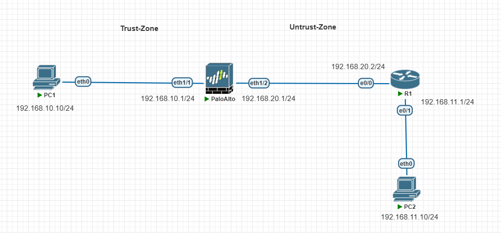
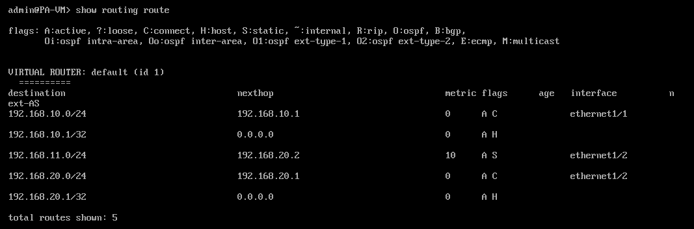
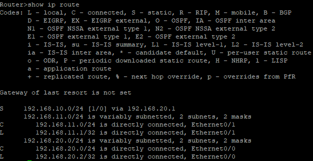

# Palo Alto Static Route Configuration

## Objective

To configure and verify a static route for the `192.168.11.0/24`
network on a Palo Alto firewall.

## Network Topology

PC1 → Palo Alto Firewall → R1 → PC2

## IP Addressing

| Device | Interface | IP Address |
|--------|-----------|------------|
| PC1 | — | 192.168.10.10/24 |
| Palo Alto | ethernet1/1 | 192.168.10.1/24 |
| Palo Alto | ethernet1/2 | 192.168.20.1/24 |
| R1 | Ethernet0/0 | 192.168.20.2/24 |
| R1 | Ethernet0/1 | 192.168.11.1/24 |
| PC2 | — | 192.168.11.10/24 |

## Static Route Configuration

The following static route was configured on the Palo Alto firewall:

- **Destination Network:** `192.168.11.0/24`
- **Next Hop:** `192.168.20.2`
- **Outgoing Interface:** `ethernet1/2`

### Palo Alto Interfaces

### Static Route

### R1 Routing Table

## Verification

Connectivity was verified by sending ping requests from PC1
(`192.168.10.10`) to PC2 (`192.168.11.10`).

## Result

The static route was successfully configured on the Palo Alto
firewall, and connectivity between PC1 and PC2 was successfully
verified.

## Tools Used

- PNETLab
- Palo Alto Firewall
- Cisco Router
- VPCS
- VMware Workstation
